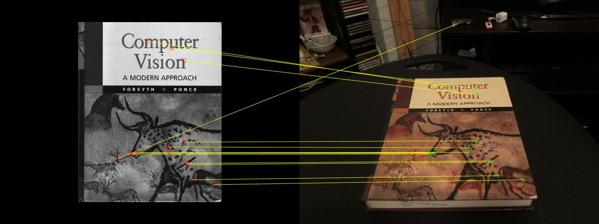
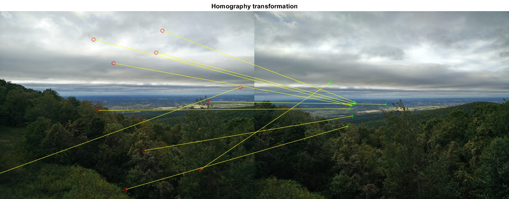
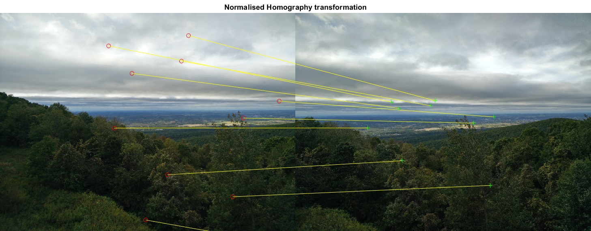
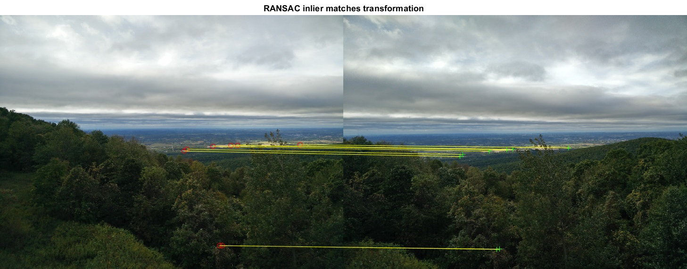
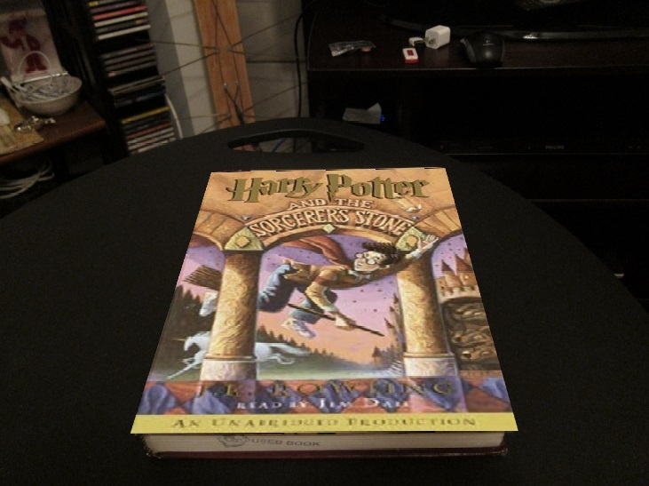
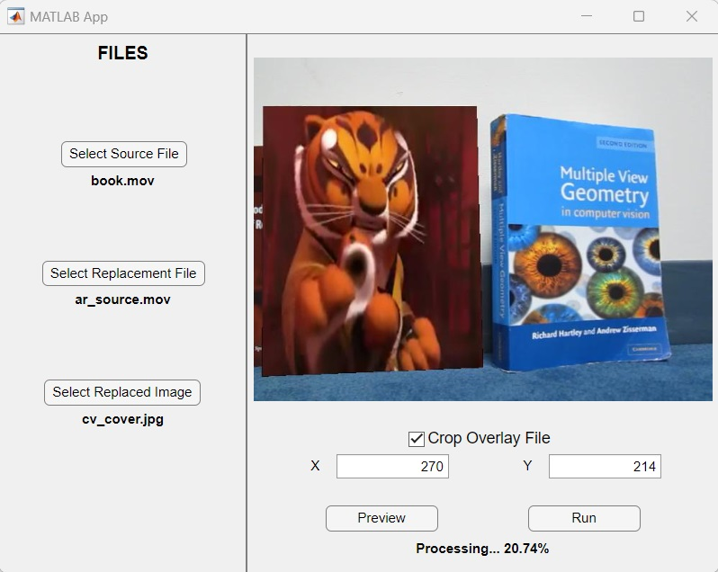

<!-- PROJECT LOGO -->

  
  
# AR Homographies

<!-- PROJECT SHIELDS -->
[![Contributors][contributors-badge]][contributors]
[![Licence][licence-badge]][licence]
[![LinkedIn][linkedin-badge]][linkedin]

**Planar Homographies in AR**

Techniques for overlaying images onto specific regions in another image using planar homographies, including feature detection, matching, and transformation.

---

<!-- TABLE OF CONTENTS -->

  
Table of Contents

  <ol>
    <li>
      <a href="#about-the-project">About The Project</a>
      <ul>
        <li><a href="#built-with">Built With</a></li>
      </ul>
    </li>
    <li><a href="#run">Run</a></li>
    <li>
      <a href="#functional-areas">Functional Areas</a>
      <ul>
        <li><a href="#feature-detection-and-matching">Feature Detection and Matching</a></li>
        <li><a href="#homography-computation">Homography Computation</a></li>
        <li><a href="#homography-normalisation">Homography Normalisation</a></li>
        <li><a href="#ransac-algorithm">RANSAC Algorithm</a></li>
        <li><a href="#augmented-reality-application">Augmented Reality Application</a></li>
        <li><a href="#app">App</a></li>
      </ul>
    </li>
    <li><a href="#contributors">Contributors</a></li>
    <li><a href="#licence">Licence</a></li>
  </ol>

<!-- ABOUT THE PROJECT -->
## About The Project

AR Homographies is a project developed for the course in Computer Vision in the Spring semester of 2023. The project explores the application of planar homographies to create Augmented Reality experiences. This project focuses on overlaying an image onto a specific region of another image or video by detecting and matching feature points, computing the homography matrix, and applying it to warp the image.

The core functionality involves using the FAST feature detector and BRIEF descriptor to identify and match salient points between images. The Direct Linear Transform method is employed to estimate the homography matrix, with coordinate normalisation enhancing numerical stability. The RANSAC algorithm is integrated to robustly estimate the homography by identifying inliers from random subsets of matched points.

The AR Homographies application provides a real-time interface for users to load images, compute homographies, and visualise the augmented result. By demonstrating how planar homographies can be used to blend virtual content with real scenes, the project showcases the potential of AR technology to transform everyday images and videos with interactive elements.

### Built With

* [![MATLAB][matlab-badge]][matlab]

<!-- RUN -->
## Run

All relevant code is located in the `matlab` folder.

The `App` folder features a MATLAB App that can be opened by running the `ARHomographies.exe` file.

<!-- FUNCTIONAL AREAS -->
## Functional Areas

### Feature Detection and Matching

Feature Detection and Matching are foundational for establishing correspondences between the source and target images or videos. In this project utilises MATLAB's built-in FAST detector to identify key feature points in both images and the BRIEF descriptor to characterise these points. By matching these features, it's possible to find corresponding points between the two images. This step is crucial because accurate feature matching ensures that the subsequent homography transformation aligns the images correctly.

### Homography Computation

Homography Computation is the core process to map points from one image to another, enabling the projection of the source image onto the target. This is implemented this by solving the Direct Linear Transform problem using Singular Value Decomposition. The computed homography matrix, transforms the source image to align with the target image based on the established correspondences. This matrix is essential for accurately projecting the source image onto the target object, ensuring that the overlay appears correctly positioned and oriented.

### Homography Normalisation

Homography Normalisation enhances the numerical stability and accuracy of the homography computation. The normalisation process, which involves translating and scaling the coordinates before computing the homography and then denormalizing the result, improves the robustness of the homography estimation. This step is crucial for reducing the impact of numerical errors and ensuring that the homography transformation is accurate and reliable. It contributes to the final goal by ensuring that the projected image or video aligns correctly with the target object despite potential numerical inaccuracies.

### RANSAC Algorithm

The RANSAC (Random Sample Consensus) algorithm is used to robustly estimate the homography matrix in the presence of noise and outliers. By iteratively selecting random subsets of point correspondences and computing the homography for each subset, RANSAC identifies the transformation with the most inliers—matches that fit well with the estimated homography. Implementing RANSAC helps filter outliers and ensures that the final homography matrix is accurate and stable. This robustness is crucial for achieving precise image projection, even when some matches are noisy or incorrect.

### Augmented Reality Application

The Augmented Reality (AR) Application integrates all previous steps to achieve the final goal of projecting an image or video onto an object in another image or video. By applying the computed homography matrix, the source image or video frames are warped onto the target object in the video. This process tracks the target object in each video frame and overlays the source content, demonstrating the practical use of planar homographies in creating interactive AR experiences, allowing for dynamic visual effects.

### App

The Poisson Image Blending project features a MATLAB app designed using App Designer, which simplifies the image blending process. Users can easily select source and target images, create or load masks, and define the offset for placing the source image on the target image. The app provides an intuitive interface for visualising the blending results in real-time and allows users to export the final blended image. This tool offers a user-friendly way to experiment with and apply Poisson image blending techniques, making complex image compositing tasks more accessible and efficient.

<!-- CONTRIBUTION -->
## Contributors

- Andrei Harbachov ([Github][andrei-github] · [LinkedIn][andrei-linkedin])

<!-- LICENCE -->
## Licence

Because AR Homographies is MIT-licensed, any developer can essentially do whatever they want with it as long as they include the original copyright and licence notice in any copies of the source code.

<!-- MARKDOWN LINKS -->
<!-- Badges and their links -->
[contributors-badge]: https://img.shields.io/badge/Contributors-1-44cc11?style=for-the-badge
[contributors]: #contributors
[licence-badge]: https://img.shields.io/github/license/andreihar/ar-homographies.svg?color=000000&style=for-the-badge
[licence]: LICENSE
[linkedin-badge]: https://img.shields.io/badge/LinkedIn-0077B5?style=for-the-badge&logo=linkedin&logoColor=white
[linkedin]: https://www.linkedin.com/in/andreihar/
[matlab-badge]: https://img.shields.io/badge/matlab-08609d?style=for-the-badge&logo=zalando&logoColor=ffffff
[matlab]: https://www.mathworks.com/products/matlab.html/

<!-- Socials -->
[andrei-linkedin]: https://www.linkedin.com/in/andreihar/
[andrei-github]: https://github.com/andreihar